<p align="center">
  <picture>
    <source media="(prefers-color-scheme: dark)" srcset="assets/tiresias-dark.svg">
    
  </picture>
</p>

**Verifiable analytics over data you never reveal.**

[](https://github.com/EgorKhaklin/tiresias/actions/workflows/ci.yml)
[](LICENSE)
[](https://www.python.org/)
[](https://github.com/EgorKhaklin/Glass)

Named for Tiresias, the seer of Thebes who knew the truth without seeing it. Formerly Glass
Private Intelligence (GPI); the package, its command and its settings keep the short name `gpi`.

An organization commits a sensitive dataset, then anyone can run *aggregate*
queries against it and receive **the answer plus a zero-knowledge proof that the
answer is the true result of that query over the committed data** — revealing
only the commitment, the query, and the answer. Never a row.

Built on [Glass](https://github.com/EgorKhaklin/Glass) — a self-hosting verifiable
language whose from-scratch zk-STARK toolkit does the proving.

> ### Honesty first
> The cryptography here is **educational-grade** (Baby Bear field, unaudited
> hash — inherited from Glass; see [`docs/soundness`](https://github.com/EgorKhaklin/Glass/blob/main/docs/soundness.md)).
> It is a **working demonstration of the idea**, end to end — not a vault for real
> secrets yet. Every artifact Tiresias produces is stamped `crypto-grade: educational`.
> What *is* rigorous is the structure and the differential-testing discipline
> behind Glass. We say exactly what's real and what's roadmap, by design — because
> a product that sells *verifiability* cannot afford to overclaim.

---

## What it's for

Anywhere you must **share a number but not the data**:

- **Audits & regulatory reporting** — prove an aggregate to a regulator without handing over records.
- **Cross-org benchmarking** — companies contribute to an industry benchmark; nobody sees anyone's rows.
- **Data clean rooms** — answer a partner's aggregate question over private data.
- **Confidential due diligence** — prove revenue/headcount totals without exposing the ledger.

## Requirements & dependencies

- **Python 3.12** (the proving engine, Glass, requires 3.10+).
- **The Glass engine** — Tiresias is built on and depends on
  [Glass](https://github.com/EgorKhaklin/Glass) at **runtime** for all proving.
  Clone it and point Tiresias at it via `GPI_GLASS_DIR` (default `~/Desktop/Glass`):

  ```bash
  git clone https://github.com/EgorKhaklin/Glass ~/Desktop/Glass
  export GPI_GLASS_DIR=~/Desktop/Glass          # only the local prover needs this
  ```

  > The **registry server is engine-free** — it never loads Glass and never sees a
  > row. Only the **local prover** (`gpi commit` / `remote-commit` / `remote-query`)
  > invokes the Glass engine, on the machine where the data lives.

- **No third-party Python packages** — Tiresias itself is pure standard library.

## Install

```bash
git clone https://github.com/EgorKhaklin/tiresias
cd tiresias
pip install -e .                 # installs the `gpi` command (use a Python 3.12 env)
```

## 60-second demo

```bash
python3.12 -m gpi.demo           # commit → query → verify → tamper-rejected
```

You'll watch a company commit a payroll, prove `AVG(salary) WHERE dept='eng'`,
have an auditor verify it against the public commitment **without the data**, and
watch a forged answer get **rejected**.

## The zero-trust SaaS, in five commands

Proving runs **where the data lives**; the registry only stores and verifies and
**never sees a row**.

```bash
# 1. run the registry (multi-tenant, engine-free)
GPI_ADMIN_TOKEN=secret gpi serve

# 2. provision a tenant + API key (admin)
gpi create-org "Acme Health"

# 3. on the data-holder's machine: commit locally, upload only the manifest
GPI_API_KEY=gpi_live_… gpi remote-commit payroll.csv --types "dept=category,remote=bool"

# 4. prove a query locally, upload only the bundle (rows never leave)
gpi remote-query <dataset_id> "SELECT SUM(salary) GROUP BY dept" --data payroll.csv

# 5. hand a regulator a public link that verifies the result — no account, no data
gpi share <bundle_id>            # -> http://<registry>/v/<token>
```

## Architecture

```
  DATA-HOLDER's machine                          REGISTRY (SaaS / self-hosted)
  ┌────────────────────────┐                    ┌──────────────────────────────┐
  │ gpi remote-commit      │  manifest  ──────▶ │ multi-tenant, API-key auth   │
  │ gpi remote-query       │  proof bundle ───▶ │ SQLite + audit log           │
  │  Glass proves LOCALLY  │                    │ engine-free: never sees a row│
  │  rows NEVER leave      │  ◀── verify (T1) ─ │ verifies binding, serves UI  │
  └────────────────────────┘                    └──────────────┬───────────────┘
                                                               │ public link
                                                   anyone ──────▶ /v/<token>  (no account, no data)
```

## Query surface

```sql
SELECT SUM(salary)   WHERE dept = 'eng'
SELECT COUNT(*)      WHERE remote = 'true'
SELECT AVG(salary)   WHERE level > 3            -- proven as sum + count
SELECT MIN(level)    WHERE dept = 'eng'
SELECT MAX(level)
SELECT dept, SUM(salary) GROUP BY dept          -- per-segment, each proven
```

Filters: `=  !=  <  >  <=  >=`, `AND` / `OR`. Columns may be `int`, `bool`, or
`category` (string labels mapped to codes in the public manifest).

## Trust tiers (what a proof actually buys you)

| Tier | Who | Needs the data? | Guarantees |
|---|---|---|---|
| **1 — Binding** | anyone (public link) | no | the answer is tied to a published, immutable commitment; it can't be swapped |
| **2 — Reproducible soundness** | the data-holder | yes | re-runs the proof; the prover could not have lied about the answer |
| **3 — Witness-free** *(roadmap)* | any third party | no | independently re-verify the proof math without the data |

Tier 3 is the north star; it needs an out-of-circuit STARK verifier (Glass
Track R) and is bounded by the educational-grade primitives.

## Honest limits

- **Comparisons (`MIN`/`MAX`, `<`/`>`)** work on values **< 65,536** (Glass's
  comparison gadget). Tiresias refuses out-of-range comparisons with a clear error.
  Equality filters and SUM/COUNT/AVG/GROUP BY have no such limit.
- **Sums must stay below the field** (~2.147 B). Tiresias refuses a SUM/AVG/GROUP BY
  whose total would overflow, rather than proving a wrapped (unsound) value.
  Scale large columns to smaller units before committing.
- **GROUP BY** keys are categorical.

## Deployment

```bash
docker compose -f deploy/docker-compose.yml up --build      # self-hosted registry
```

The registry image is **engine-free** (no Glass, no third-party deps) — it only
stores and verifies. The local prover runs where the data lives.

## Repository layout

```
gpi/
  engine/     schema, commit, the Glass driver adapter, prover, verifier, bundles
  query/      Pane AST, SQL-subset parser, query spec
  registry/   multi-tenant server, SQLite store, auth, landing + console + public-view
  client/     local prover + registry HTTP client (zero-trust upload)
  sdk.py      LocalEngine + Gpi facade for embedding
  cli.py      the `gpi` command
research/     witness-free verification spike (NOT a product feature)
deploy/       Dockerfile + docker-compose (engine-free registry)
docs/         api.md, pitch.md
tests/        unit + engine roundtrip
```

## Development

```bash
python3.12 -m unittest discover -s tests     # fast unit tests + one engine roundtrip
python3.12 -m gpi.demo                        # full narrated demo
```

Pure standard library — no third-party Python dependencies.

## Roadmap

1. **Witness-free third-party verification** — serialized proof + out-of-circuit STARK verifier.
   A research spike in [`research/witness_free_spike.py`](research/witness_free_spike.py)
   demonstrates the serialization + witness-free FRI re-execution and pins down the
   exact remaining blocker (the ZK blinding construction).
2. **Production cryptography** — Goldilocks field end-to-end, audited Poseidon hash, parameter analysis, external audit.
3. **Broader queries** — large-value comparisons, multi-key GROUP BY, joins.

## Built on Glass

Tiresias is a product layer over [**Glass**](https://github.com/EgorKhaklin/Glass), a
self-hosting verifiable language with a from-scratch zk-STARK toolkit. Glass does
all the proving; Tiresias never reimplements cryptography. Glass is a required runtime
dependency (resolved via `GPI_GLASS_DIR`) and is itself licensed Apache-2.0 / MIT.
See [`NOTICE`](NOTICE).

## License

Apache-2.0 © Egor Khaklin. See [`LICENSE`](LICENSE) and [`NOTICE`](NOTICE).
